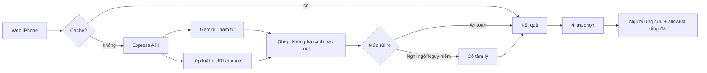
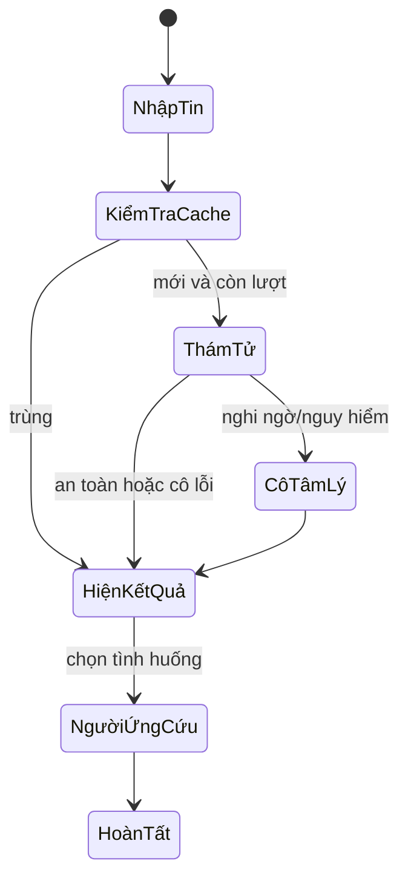

# Kiến trúc và máy trạng thái

Cách gọi ngây thơ luôn gọi ba nhân vật: 3 lượt/tin. Máy trạng thái gọi 1 lượt cho tin an toàn, 2 lượt cho tin đáng ngờ và chỉ gọi lượt thứ ba khi người dùng yêu cầu ứng cứu; giảm 33–67% ở luồng phân tích.
